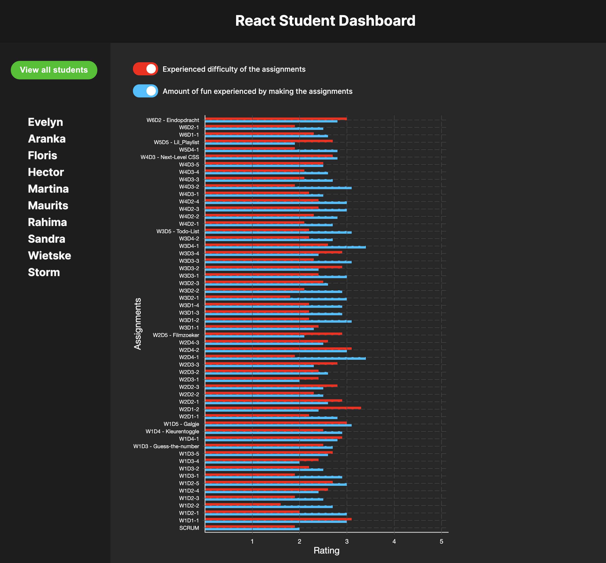

 ## React Student Dashboard

##  Goal
As a final assignment of my Front-end Development course at Winc Academy the goal was to create a 'Student dashboard'. In this dashboard you must be able to see at a glance how all students evaluate 50+ assignments on the scope of 'fun' and 'difficulty'. Out of an Excel-sheet with raw data I had to build a logic and easy to use interface which shows all data in a bar chart. The evaluation of each student, per assignment, should be made visible. As well as the averages of all students.
This application has to be built with use of the Javascript React framework.

## Requirements:
The WebApplication must display the following:
- Dashboard Overview User-story: As a user, when I open the homepage of the application I want to see an overview in the form of a bar chart of the evaluations (fun & difficult) of all students. As a user, I must be able to distinguish at a glance between the assignments and the fun/difficult evaluation. Make sure that a clear distinction is made visually, for example by working with clear colours. 

- Separate routing per student As a user I want to see a list of the names of all students and be able to click on one of these students. When I click on a student name I am taken to the route /{name-of-student}. The bar chart adjusts with the data of only this student.

- As a user, I want to be able to indicate by means of a checkbox whether I only want to show in the bar chart how nice the assignment was, only want to see how difficult the assignment was, or both.

## Link to the project

## Run with 'npm start'
Navigate to the application directory.
With the command 'npm start' you are able to run the application out of the terminal.
Open [http://localhost:3000](http://localhost:3000) to view the application in your browser.

